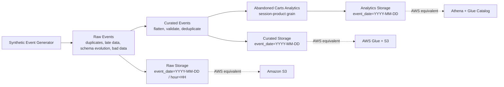

# AWS Event-Driven E-commerce Pipeline

Local-first, AWS-shaped data engineering project that simulates messy e-commerce event data and processes it into curated and analytics-ready datasets.

The project is designed around real event pipeline problems such as:
- duplicates
- late-arriving data
- schema evolution
- bad data
- small files
- incremental-style reprocessing

## Business Goal

Build an e-commerce event pipeline that supports downstream analytics, with a focus on the `abandoned_carts` use case.

The final analytics layer answers questions such as:
- how many carts were abandoned per day
- how many carts were converted into purchases
- what was the cart value
- how long it took users to convert after adding items to cart

## Tech Stack

- Python
- PySpark
- JSONL
- local file-based raw / curated / analytics layers
- Amazon S3
- AWS Glue
- AWS Glue Crawlers
- AWS Glue Data Catalog
- Amazon Athena

## Architecture



### Raw Layer

Synthetic event data is generated into a raw zone partitioned by ingestion time.

Example layout:

```text
data/raw/events/event_date=YYYY-MM-DD/hour=HH/
```

Characteristics:
- append-like raw ingestion
- many small files
- duplicates
- late-arriving events
- schema evolution (`v1`, `v2`)
- bad data injected intentionally for validation logic

### Curated Layer

Raw events are flattened, validated, deduplicated, and written into curated partitions by event date.

Example layout:

```text
data/curated/events/event_date=YYYY-MM-DD/events.jsonl
data/curated_spark/events/event_date=YYYY-MM-DD/part-*.json
```

Curated processing includes:
- flattening nested `payload`
- filtering invalid rows
- deduplication by `event_id`
- `last-write-wins` based on `ingestion_timestamp`
- `event_timestamp` tie-breaker for edge cases
- partition-level reprocessing by `event_date`

### Analytics Layer

The final analytics output is an `abandoned_carts` dataset.

Example layout:

```text
data/analytics/abandoned_carts.jsonl
data/analytics_spark/abandoned_carts/event_date=YYYY-MM-DD/part-*.json
```

## Event Model

Each raw event contains:
- `event_id`
- `event_type`
- `event_timestamp`
- `ingestion_timestamp`
- `event_version`
- `user_id`
- `session_id`
- `country`
- `event_source`
- optional `device_type`
- nested `payload`

Payload fields:
- `product_id`
- `category`
- `price`
- `currency`
- `quantity`
- `cart_value`

## Data Engineering Scenarios Covered

### Duplicates

The generator creates duplicate events with the same `event_id`, but duplicates may contain slightly different values and later ingestion timestamps.

Dedup strategy:
- partition by `event_id`
- keep the latest record by `ingestion_timestamp`
- use `event_timestamp` as a tie-breaker

### Late Data

A share of events is intentionally ingested 1-2 days late, and some arrive 3-7 days late.

This is used to simulate:
- late-arriving event handling
- reprocessing of affected curated partitions

### Schema Evolution

The generator emits:
- `v1` events without `device_type`
- `v2` events with `device_type`

This simulates schema changes over time.

### Bad Data

A small share of events contains invalid values such as:
- `price = null`
- `country = null`

Curated processing filters invalid records for business-critical event types.

### Session Realism

The generator creates simple event sequences such as:
- `page_view`
- `page_view -> add_to_cart`
- `page_view -> add_to_cart -> purchase`

This makes downstream abandoned cart analytics realistic.

## Pipeline Steps

### 1. Generate raw events

Script:

```text
src/generator/generate_events.py
```

Generates raw event files partitioned by ingestion time.

### 2. Curate raw events in plain Python

Script:

```text
src/glue_jobs/curate_events.py
```

Responsibilities:
- load raw JSONL files
- flatten payload
- validate records
- deduplicate events
- write curated partitions by `event_date`

### 3. Curate raw events in PySpark / Glue-style

Script:

```text
src/glue_jobs/glue_curate_events.py
```

Responsibilities:
- Spark-based curated processing
- partitioned output by `event_date`
- dynamic partition overwrite
- Glue-style transformation logic

### 4. Build abandoned carts in plain Python

Script:

```text
src/transform/build_abandoned_carts.py
```

Responsibilities:
- group events by `user_id`, `session_id`, `product_id`
- match `add_to_cart` with `purchase`
- compute abandonment flag and time to purchase

### 5. Build abandoned carts in PySpark / Glue-style

Script:

```text
src/glue_jobs/glue_build_abandoned_carts.py
```

Responsibilities:
- Spark-based analytics output
- partitioned output by `event_date`
- abandoned cart metrics at session-product grain

## Abandoned Carts Output

Grain:
- one row per `user_id`, `session_id`, `product_id`

Fields:
- `event_date`
- `user_id`
- `session_id`
- `product_id`
- `added_to_cart_ts`
- `purchased_ts`
- `cart_value`
- `abandoned_cart_flag`
- `time_to_purchase_minutes`

## Example Run

Generate data:

```bash
python src/generator/generate_events.py --session-count 30 --days 5 --duplicate-ratio 0.2 --late-ratio 0.2 --v2-ratio 0.5 --files-per-hour 2
python src/generator/generate_events.py --session-count 10 --days 1 --duplicate-ratio 0.2 --late-ratio 0.3
```

Curate:

```bash
python src/glue_jobs/curate_events.py
python src/glue_jobs/glue_curate_events.py
```

Build analytics:

```bash
python src/transform/build_abandoned_carts.py
python src/glue_jobs/glue_build_abandoned_carts.py
```

## Current Output Example

Spark analytics output currently produces:
- abandoned carts
- purchased carts
- non-null `time_to_purchase_minutes`
- multiple event-date partitions

This confirms that the pipeline supports both abandoned and converted session flows.

## AWS Deployment (Verified)

The pipeline was deployed and validated on AWS using:

- Amazon S3 for raw, curated, and analytics storage
- AWS Glue jobs for Spark-based transformations
- AWS Glue Crawlers for cataloging partitioned datasets
- AWS Glue Data Catalog for table metadata
- Amazon Athena for querying curated and analytics outputs

Validated flow:
- raw JSONL files uploaded to S3
- `raw-to-curated` Glue job executed successfully
- curated partitions registered through Glue Crawler
- `curated-to-abandoned-carts` Glue job executed successfully
- analytics partitions registered through Glue Crawler
- Athena queries returned expected results for both curated and abandoned cart datasets

## AWS Mapping

This project was first implemented locally and then validated on AWS.

AWS services used in the deployed version:
- Raw zone -> Amazon S3
- Curated and analytics transformations -> AWS Glue
- Table discovery -> AWS Glue Crawlers + Glue Data Catalog
- Query layer -> Amazon Athena

Target S3 layout:

```text
s3://<bucket>/raw/events/event_date=YYYY-MM-DD/hour=HH/
s3://<bucket>/curated/events/event_date=YYYY-MM-DD/
s3://<bucket>/analytics/abandoned_carts/event_date=YYYY-MM-DD/
```

## Incremental Processing Strategy

The local project currently reprocesses datasets from local files, but the intended AWS strategy is:

- raw ingestion is append-only
- new raw partitions are detected by ingestion time
- affected `event_date` partitions are identified from incoming records
- only impacted curated and analytics partitions are rewritten

## Limitations / Next Steps

- incremental checkpointing is not fully implemented yet
- Spark jobs currently read all local partitions before AWS deployment refinement
- IAM permissions can be narrowed from broad access to bucket-level least privilege
- Airflow orchestration is planned as the next step
- Terraform infrastructure-as-code is planned but not implemented yet

## Why This Project Matters

This project is meant to demonstrate practical data engineering thinking, not just file movement.

It shows:
- event data modeling
- realistic messy data simulation
- deduplication strategy
- late-data handling
- schema evolution
- data quality filtering
- curated layer design
- business-facing analytics output
- a migration path from local PySpark to AWS Glue and Athena
