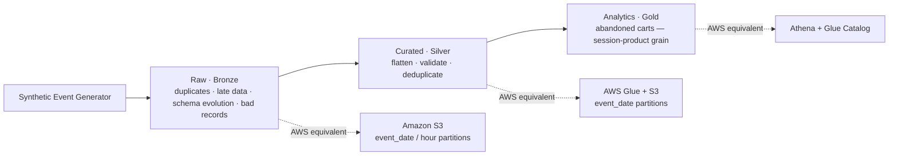

# E-commerce Event Pipeline on AWS

   

End-to-end data engineering pipeline built on AWS, ingesting synthetic e-commerce event data and processing it into curated and analytics-ready datasets. Implements a local-first pipeline validated against real AWS services, using AWS Glue for Spark-based transformations, S3 for partitioned storage, and Athena for querying.

The project deliberately introduces messy production-like data problems — duplicates, late-arriving events, schema evolution, and bad records — so every pipeline layer has to handle them explicitly rather than relying on clean tutorial data. The final output is an abandoned carts analytics dataset that can answer conversion, cart value, and time-to-purchase questions per day.

## Key Highlights

- Local Python and Glue-style PySpark implementations of the same pipeline, runnable without AWS
- Messy event simulation with duplicates, late data (1–7 days), schema evolution (v1/v2), and injected bad records
- Deterministic deduplication strategy: last-write-wins by `ingestion_timestamp`, `event_timestamp` as tie-breaker
- Event-date partition reprocessing for late-arriving data
- Abandoned cart analytics at session-product grain with abandonment flag and time-to-purchase
- Structured quality summary logged per run: rejection breakdown by category, dedup rate, conversion split
- Airflow DAG (local Docker demo) with `GlueJobOperator` and `GlueCrawlerOperator` for production migration path
- Terraform provisioning of all AWS resources: S3, Glue jobs, crawlers, Glue Catalog, IAM, Athena workgroup
- CI pipeline on GitHub Actions for linting and test execution

## Architecture

The pipeline follows a Medallion architecture: Raw (Bronze) → Curated (Silver) → Analytics (Gold).


```mermaid
flowchart LR
    A["Synthetic Event Generator"] --> B["Raw · Bronze\nduplicates · late data · schema evolution · bad records"]
    B --> C["Curated · Silver\nflatten · validate · deduplicate"]
    C --> D["Analytics · Gold\nabandoned carts — session-product grain"]

    B -. "AWS equivalent" .-> E["Amazon S3\nevent_date / hour partitions"]
    C -. "AWS equivalent" .-> F["AWS Glue + S3\nevent_date partitions"]
    D -. "AWS equivalent" .-> G["Athena + Glue Catalog"]
```

## Pipeline Evidence

### Glue Jobs


### Glue Job Run


<details>
<summary><strong>More AWS and Athena evidence</strong></summary>

### Glue Data Catalog


### Athena — Conversion Rate by Day


### Athena — Lost Cart Value by Day


### Athena — Average Time to Purchase


### Airflow DAG Graph (Local Docker Demo)


</details>

## Output

Abandoned carts analytics dataset at session-product grain, partitioned by event date.

`event_date | user_id | session_id | product_id | added_to_cart_ts | purchased_ts | cart_value | abandoned_cart_flag | time_to_purchase_minutes`

## Stack

| Layer | Technology |
|---|---|
| Compute | AWS Glue / PySpark |
| Storage | Amazon S3 (partitioned JSONL / Parquet) |
| Cataloging | AWS Glue Crawlers + Glue Data Catalog |
| Query | Amazon Athena |
| Orchestration | Apache Airflow (local Docker demo; MWAA-ready DAG) |
| Infrastructure | Terraform |
| CI | GitHub Actions + pytest + ruff |

## AWS Resources

| Resource | Name / Purpose |
|---|---|
| S3 raw bucket | `raw/events/event_date=YYYY-MM-DD/hour=HH/` |
| S3 curated bucket | `curated/events/event_date=YYYY-MM-DD/` |
| S3 analytics bucket | `analytics/abandoned_carts/event_date=YYYY-MM-DD/` |
| S3 quarantine bucket | `quarantine/rejected_events/event_date=YYYY-MM-DD/` |
| Glue job | `raw-to-curated` — flattens, validates, deduplicates |
| Glue job | `curated-to-abandoned-carts` — builds analytics output |
| Glue Crawlers | register curated and analytics partitions in the Catalog |
| Athena workgroup | queries curated and analytics tables |

## Engineering Overview

- Deterministic deduplication: partition by `event_id`, keep latest `ingestion_timestamp`, `event_timestamp` as tie-breaker
- Event-date partition reprocessing: affected `event_date` partitions are identified from incoming records and dynamically overwritten
- Two parallel implementations of every transformation — plain Python for local dev and Glue-style PySpark for AWS — so the pipeline is testable without AWS credentials
- Glue jobs read S3 paths from environment variables; no hardcoded bucket names anywhere in the codebase
- S3 data is partitioned by `event_date`; Athena uses partition pruning to scan only the requested date range, reducing both query cost and latency
- Structured quality summary logged to CloudWatch at the end of every Glue run: rejection breakdown by category, dedup rate, conversion split
- SLA-style validation: missing business-critical fields (`event_id`, `event_timestamp`) and invalid cart/purchase prices are tracked as named rejection categories, not silently dropped
- Airflow DAG uses `GlueJobOperator` and `GlueCrawlerOperator` matching the MWAA API — local Docker demo is configuration-only migration away from production
- Terraform provisions all AWS resources; uploading Glue scripts to S3 is a separate deployment step to keep infra and code lifecycle independent
- IAM role uses `AWSGlueServiceRole` plus a scoped inline policy limited to the four project S3 buckets (raw, curated, analytics, quarantine)

## Data Quality Rules

Rules applied at the Curated (Silver) layer. Rejected records are written to the quarantine bucket for investigation rather than silently dropped.

| Rule | Applies to | Action |
|---|---|---|
| `event_id` is null | All events | Reject → quarantine |
| `event_timestamp` is null | All events | Reject → quarantine |
| `price` is null | `add_to_cart`, `purchase` | Reject → quarantine |
| Duplicate `event_id` | All events | Keep latest by `ingestion_timestamp` |

Future improvement: [AWS Glue Data Quality](https://docs.aws.amazon.com/glue/latest/dg/glue-data-quality.html) or Great Expectations for declarative rule management.

## Why AWS Glue

| Requirement | Why Glue fits |
|---|---|
| Serverless Spark | No cluster management — workers spin up per job run |
| Native S3 integration | Reads/writes S3 partitions with dynamic partition overwrite |
| Glue Data Catalog | Auto-registers partitions so Athena can query immediately after each run |
| Pay-per-use | Billed per DPU-second; cost-effective for daily batch jobs at this scale |
| MWAA-ready | `GlueJobOperator` in Airflow targets the same API as production MWAA |

EMR would add always-on cluster cost and operational overhead for a daily batch job at this scale. Lambda has a 15-minute timeout and no Spark runtime — not suitable for partition-level rewrites across multiple days.

## Data Engineering Scenarios Covered

| Scenario | How it's handled |
|---|---|
| Duplicates | Last-write-wins dedup by `ingestion_timestamp`; `event_timestamp` tie-breaker |
| Late-arriving data | 1–2 day and 3–7 day late events; affected `event_date` partitions reprocessed |
| Schema evolution | v1 events without `device_type`, v2 events with `device_type`; flattening handles both |
| Bad data | Null `price`, null `country`; filtered at curated layer for business-critical event types |
| Small files | Many small files per raw partition; coalesced in Glue output |

## Testing Strategy

| Test layer | Purpose |
|---|---|
| `pytest` smoke test | Runs local raw → curated → analytics without AWS |
| Unit tests — generator | Validates event structure, version distribution, duplicate/late ratios |
| Unit tests — curate_events | Covers deduplication, rejection logic, late data handling |
| Unit tests — build_abandoned_carts | Validates abandonment flag, time-to-purchase, session-product grain |
| Unit tests — aws_paths | Validates S3 path construction from env vars |

## Repository Structure

```text
src/
  generator/generate_events.py              # synthetic event generator
  glue_jobs/curate_events.py                # plain Python curation (local)
  glue_jobs/glue_curate_events.py           # PySpark / Glue-style curation
  glue_jobs/glue_build_abandoned_carts.py   # PySpark / Glue-style analytics
  transform/build_abandoned_carts.py        # plain Python analytics (local)
  utils/aws_paths.py                        # S3 path resolution from env vars
athena/
  queries/                                  # Athena SQL for analytics use cases
airflow/
  dags/ecommerce_pipeline_dag.py            # Airflow DAG (GlueJobOperator)
  docker-compose.yml
infra/
  terraform/                                # S3, Glue, IAM, Athena resources
tests/
  unit/test_generate_events.py
  unit/test_curate_events.py
  unit/test_build_abandoned_carts.py
  unit/test_aws_paths.py
  integration/test_local_pipeline_smoke.py  # full local pipeline smoke test
.github/workflows/ci.yml
```

<details>
<summary><strong>Layer Details</strong></summary>

### Raw Layer

Synthetic event data partitioned by ingestion time:

```text
data/raw/events/event_date=YYYY-MM-DD/hour=HH/
```

Each event contains: `event_id`, `event_type`, `event_timestamp`, `ingestion_timestamp`, `event_version`, `user_id`, `session_id`, `country`, `event_source`, optional `device_type`, nested `payload` (`product_id`, `category`, `price`, `currency`, `quantity`, `cart_value`).

Injected problems: duplicates with same `event_id`, late-arriving events (1–7 days), v1/v2 schema variants, null `price` and `country`.

### Curated Layer

Flattened, validated, and deduplicated events partitioned by event date:

```text
data/curated/events/event_date=YYYY-MM-DD/
```

Business key for deduplication: `event_id`. Dedup strategy: last-write-wins by `ingestion_timestamp`, `event_timestamp` tie-breaker. Invalid records filtered by category and counted per run.

### Analytics Layer

Abandoned carts dataset at session-product grain:

```text
data/analytics/abandoned_carts/event_date=YYYY-MM-DD/
```

Groups events by `user_id`, `session_id`, `product_id`. Matches `add_to_cart` against `purchase` within the same session. Computes `abandoned_cart_flag` and `time_to_purchase_minutes`.

</details>

<details>
<summary><strong>Design Decisions and Trade-offs</strong></summary>

**Incremental processing:** Glue jobs use dynamic partition overwrite, which rewrites only affected `event_date` partitions. This handles late-arriving data correctly — reprocessing a partition is idempotent. Full file-level checkpointing (tracking which raw files have already been processed to avoid re-reading them) is not implemented. In production, two approaches are common: AWS Glue Job Bookmarks, which track S3 file positions automatically between job runs, or a DynamoDB state table storing the last processed file key per partition. Both prevent redundant processing as the raw zone grows.

**Airflow hosting:** The DAG runs locally via Docker Compose for demo purposes. In production, MWAA or a self-managed Airflow cluster would hold live AWS credentials and run on a schedule. The DAG code targets the same `GlueJobOperator` and `GlueCrawlerOperator` that MWAA uses, so migration is configuration-only.

**Terraform scope:** Provisions all AWS resources (S3 buckets, Glue jobs, crawlers, Glue Catalog database, IAM role, Athena workgroup). Uploading Glue scripts to S3 is a separate deployment step before `terraform apply`.

**IAM permissions:** Glue IAM role uses `AWSGlueServiceRole` plus a scoped inline policy limited to the four project S3 buckets (raw, curated, analytics, quarantine) and the scripts bucket.

</details>

## How To Run

### 1. Install dependencies

```bash
python3.11 -m venv .venv
source .venv/bin/activate
pip install -r requirements-dev.txt
```

### 2. Generate raw events

```bash
python src/generator/generate_events.py \
  --session-count 30 --days 5 \
  --duplicate-ratio 0.2 --late-ratio 0.2 \
  --v2-ratio 0.5 --files-per-hour 2
```

### 3. Run the local pipeline

```bash
python src/glue_jobs/curate_events.py
python src/glue_jobs/glue_curate_events.py

python src/transform/build_abandoned_carts.py
python src/glue_jobs/glue_build_abandoned_carts.py
```

### 4. Configure for AWS Glue

```bash
export S3_RAW_BUCKET=...
export S3_CURATED_BUCKET=...
export S3_ANALYTICS_BUCKET=...
export S3_QUARANTINE_BUCKET=...
export RAW_PREFIX=raw/events
export CURATED_PREFIX=curated/events
export ANALYTICS_PREFIX=analytics/abandoned_carts
```

### 5. Provision infrastructure with Terraform

```bash
cd infra/terraform
terraform init
terraform apply
```

Upload Glue scripts to S3 before running jobs — see `.env.example` for the scripts bucket variable.

### 6. Local quality checks

```bash
make lint
make test
make smoke-test
```

The smoke test covers a full local raw → curated → analytics path without any AWS services.
